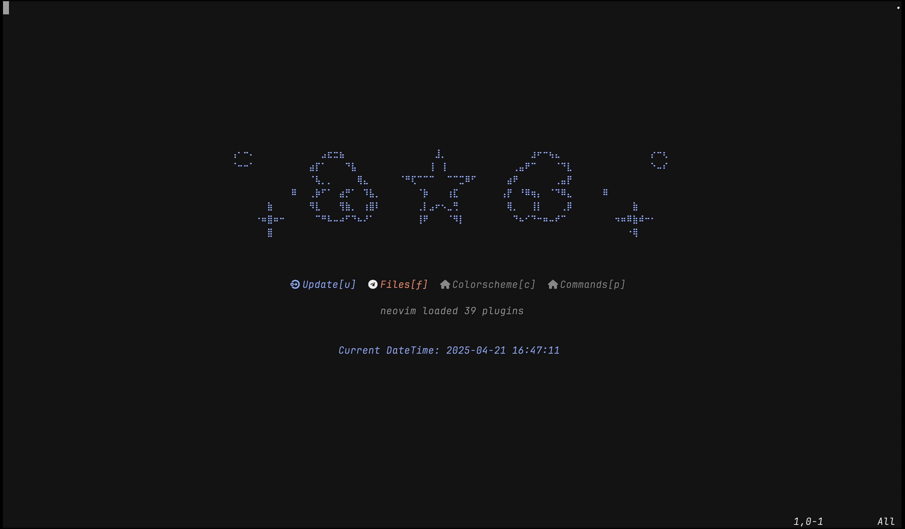
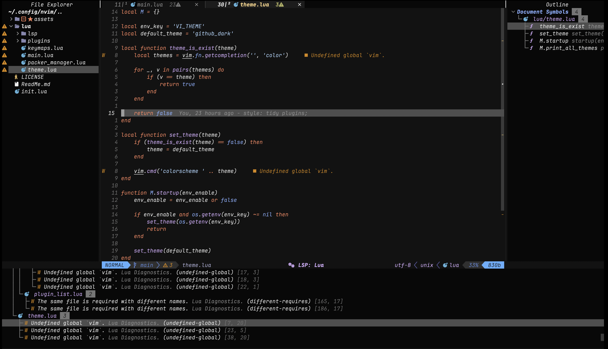
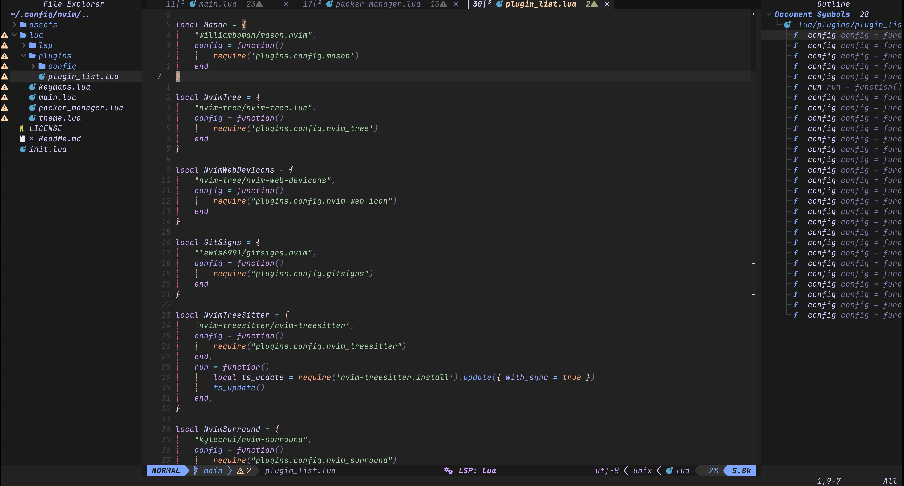
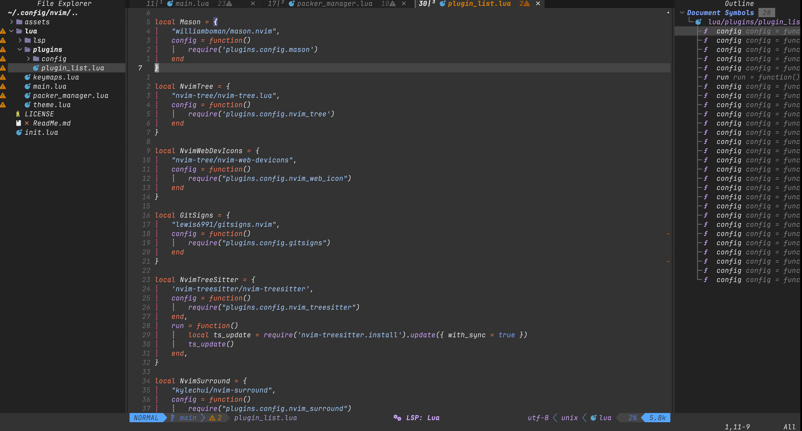
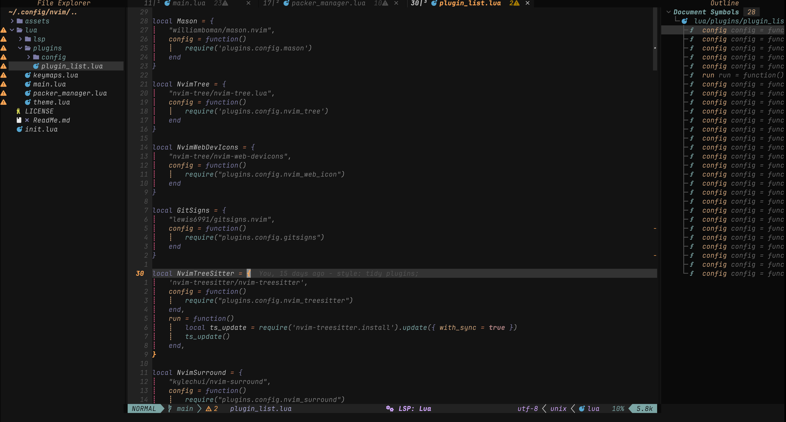

# nvim-config
The Neovim configurations.

# Neovim Configuration
NVIM v0.11.1
Build type: Release
LuaJIT 2.1.1744318430

# 💈 Media

<p align="left">
  
  
  
  
  
  
</p>

# Integration
```Shell
git clone git@github.com:ZhiWei-Ou/nvim-config.git ~/.config/nvim
```


## Fancy

## Common Key
| key | description |
|:---:|:-----------:|
|Ctrl+s|Save File|
|Ctrl+\ |Vertical Split|
|Ctrl+t|Open Inner Terminal(default display in float)|
|Ctrl+l|Toggle File Explorer|
|Ctrl+k Ctrl+p|Open Telescope entry|
|gd|Go to Definition|
|gr|Show References|
|gh|Show Comments|
|Ctrl+o|Backward Record|
|Ctrl+]|Toggle Outline|
|<leader>+dd|Toggle Diagnostics|
|Ctrl+p|Open Finder|
|Ctrl+f|Open Greper|

## Outline
1. `:Spectre` to open Spectre
2. `Trouble symbols`
3. `Trouble diagnostics`

## Current Support LSP
clangd(C/C++), lua_ls(Lua), gopls(Golang), jsonls(Json), marksman(MarkDown),
cmake(CMake), bashls(Shell), bufls(Protobuf), yamlls(YAML)

## Telescope
1. `:Telescope emoji` to search emoji

## Problem
### LSP
- mason.cmake_language_server error.
   ```bash
   apt install python3 python3-pip python3.10-venv npm
   ```
### LinuxPort
- clipboard is not work in wsl2.ubuntu2204.
    ```bash
    apt install xclip xsel wl-clipboard
    ```

