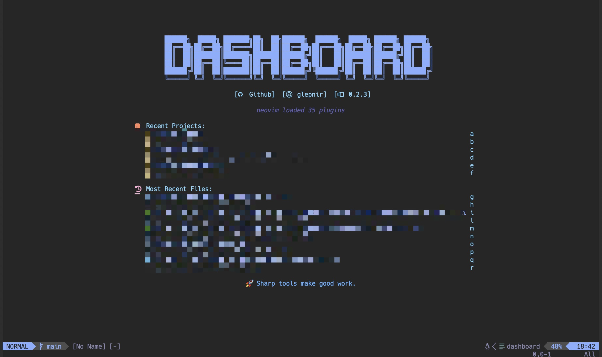
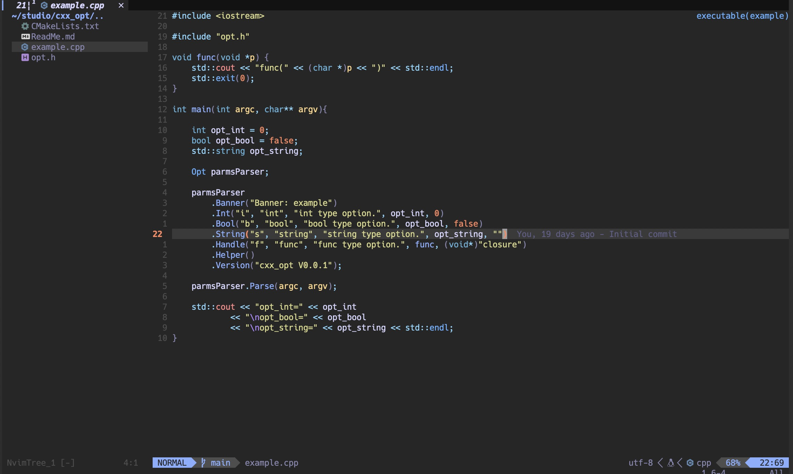
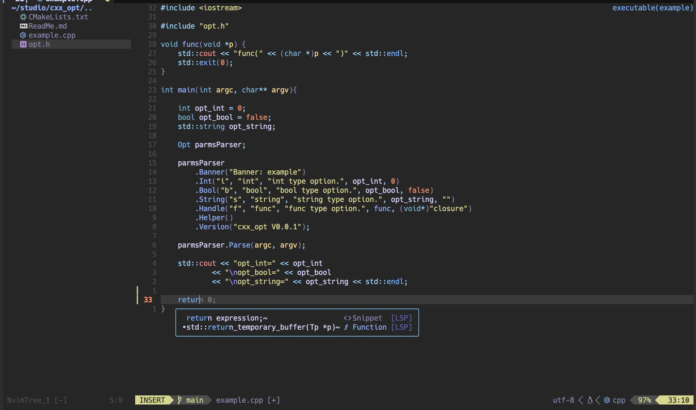
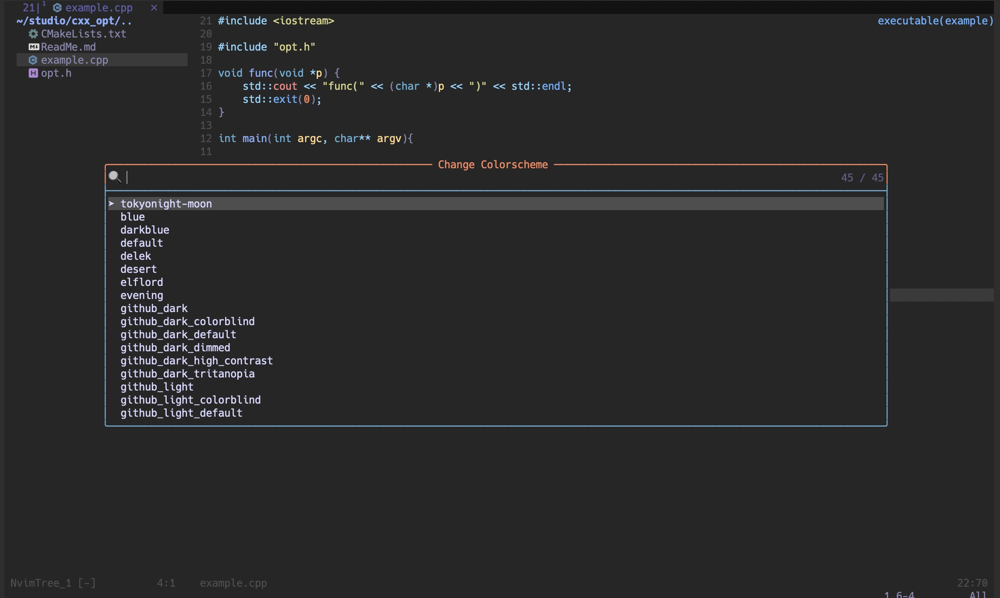
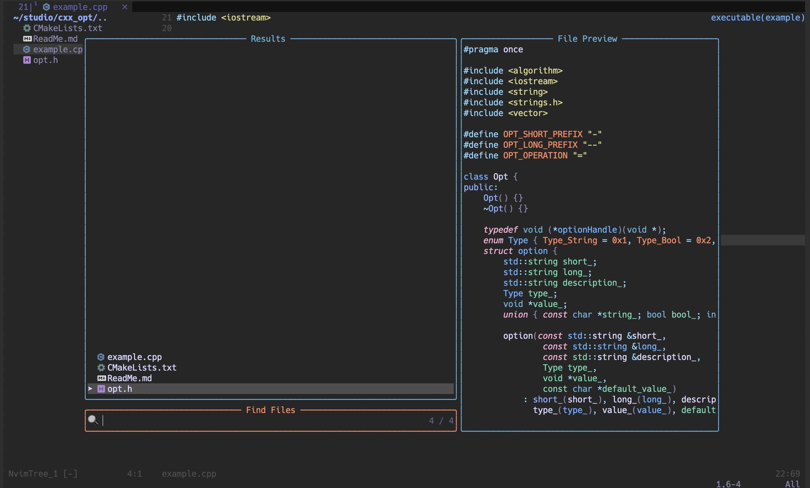
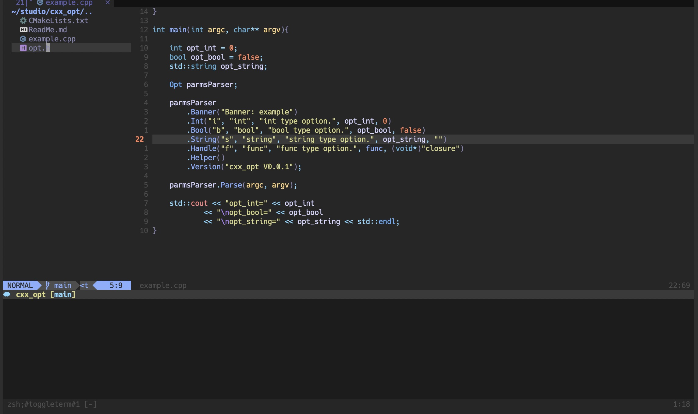
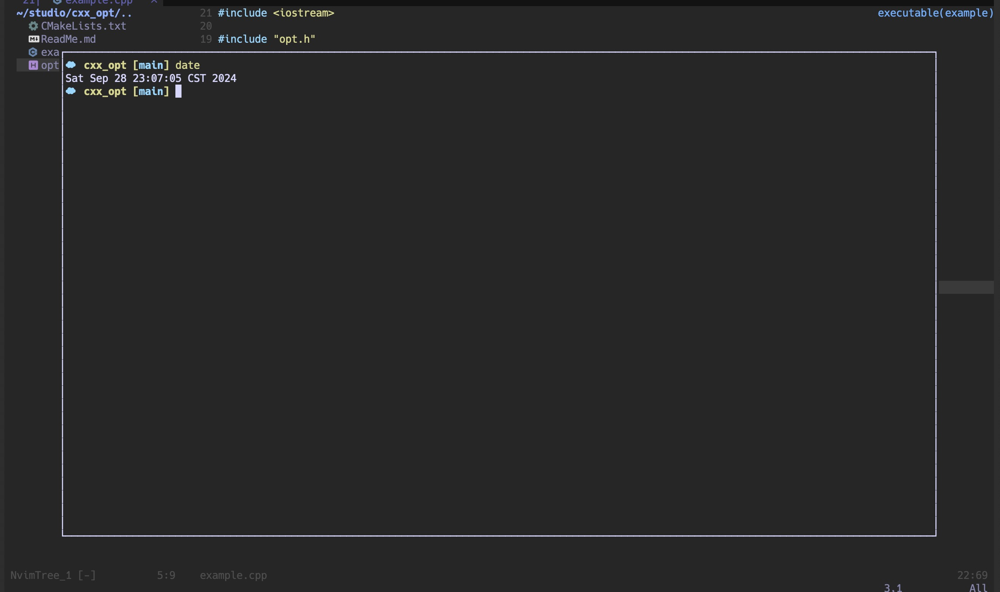

# Neovim Configuration
NVIM `v0.10.0`
Build type: `Release`
LuaJIT `2.1.1716656478`

# 💈 Media







~~[demo-video](./assets/nvim-demo.mov)~~

## Platform
Use terminal app is MacOS default terminal.
```shell
$ uname -rsm
Darwin 23.6.0 arm64
```

## Fancy
1. Select Theme
step.1: Ctrl+k Ctrl+p
step.2: Input `colorscheme`
2. About Git
step.1: Ctrl+k Ctrl+p
step.2: Input `git`
3. Code Snippet
Instruction: hpp, cpp, c, h and so on.
more details: [snip_instruction](config/nvim-luasnip.lua)

## Common Key
| key | description |
|:---:|:-----------:|
|Ctrl+s|Save File|
|Ctrl+\ |Vertical Split|
|Ctrl+t|Open Inner Terminal(default display in bottom|
|Option+b|Open or Close Directory Browser|
|Ctrl+k Ctrl+p|Open Telescope entry|
|gd|Go to Definition|
|gr|Show References|
|gh|Show Comments|
|Ctrl+o|Backward Record|
|Ctrl+l|choice code snippet when use LuaSnip|

## Current Support LSP
clangd(C/C++), lua_ls(Lua), gopls(Golang), jsonls(Json), marksman(MarkDown),
cmake(CMake), bashls(Shell), bufls(Protobuf), yamlls(YAML)

## Plugins
| numbers |  plugin | description |
|:-------:|:-------:|:-----------:|
|1|LuaSnip| [nvim-luasnip.lua](lua/config/nvim-luasnip.lua)|
|2|bufferline| [nvim-bufferline.lua](lua/config/nvim-bufferline.lua)|
|3|cmake-tools| [nvim-cmake](lua/config/nvim-cmake.lua)|
|4|cmp-buffer||
|5|cmp-cmdline||
|6|cmp-nvim-lsp||
|7|cmp-nvim-lua||
|8|cmp-path||
|9|cmp-luasnipt|[nvim-luasnip.lua](lua/config/nvim-luasnip.lua)|
|10|codeium|[nvim-codeium](lua/config/nvim-codeium.lua)|
|11|dressing|[nvim-dressing](lua/config/nvim-dressing.lua)|
|12|vim-visual-multi||
|13|github-nvim-theme|[nvim-github-theme](lua/config/nvim-github-theme.lua)|
|14|gitsigns|[nvim-gitsigns](lua/config/nvim-gitsigns.lua)|
|15|lspkind-nvim||
|16|lualine-nvim|[nvim-lualine](lua/config/nvim-lualine.lua)|
|17|mason-lspconfig|[nvim-mason-lspconfig](lua/config/nvim-mason-lspconfig.lua)|
|18|mason|[nvim-mason](lua/config/nvim-mason.lua)|
|19|nvim-cmp|[nvim-cmp](lua/config/nvim-cmp.lua)|
|20|nvim-lspconfig||
|21|nvim-spectre||
|22|nvim-surround||
|23|nvim-surround||
|24|nvim-tree.lua||
|25|nvim-treesitter||
|26|nvim-web-devicons||
|27|ouroboros||
|28|packer.nvim||
|29|plenary.nvim||
|30|telescope.nvim|[nvim-telescopt](lua/config/nvim-telescope.lua)|
|31|toggleterm.nvim|[nvim-toggleterm](lua/config/nvim-toggleterm.lua)|


## Telescope
1. `:Telescope emoji` to search emoji
