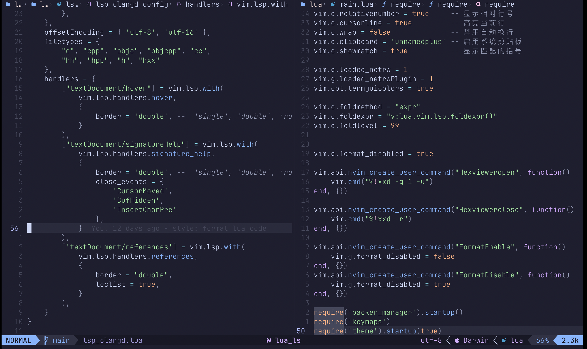

<div align="center">
<p>
    <a>
      
    </a>
    <a>
      
    </a>
    <a>
      
    </a>
    <a href="https://github.com/neovim/neovim/releases/tag/stable">
      
    </a>
    <a href="https://github.com/ZhiWei-Ou/nvim-config/search?l=vim-script">
      
    </a>
    <a href="https://github.com/ZhiWei-Ou/nvim-config/graphs/commit-activity">
      
    </a>
    <a href="https://github.com/ZhiWei-Ou/nvim-config/graphs/contributors">
      
    </a>
    <a>
      
    </a>
    <a href="https://github.com/ZhiWei-Ou/nvim-config/blob/master/LICENSE">
      
    </a>
</p>
</div>

# Introduction
My personal Neovim configuration.

<div style="display: flex; justify-content: center">
  
</div>

---

## Table of contents
- [Introduction](#introduction)
  - [Table of contents](#table-of-contents)
- [Neovim version](#neovim-version)
- [Integration](#integration)
  - [Features](#features)
  - [Special Command](#special-command)
  - [Supported LSPs](#supported-lsps)
  - [FAQ](#faq)

---

# Neovim version
<pre>
```bash
$ nvim -V1 -v
NVIM v0.11.3
Build type: Release
LuaJIT 2.1.1753364724
```
</pre>

# Integration
- install neovim to your system.
- clone this repo to `~/.config/nvim`
```Shell
git clone git@github.com:ZhiWei-Ou/nvim-config.git ~/.config/nvim
```
- run `:PackerSync`
- restart neovim
- enjoy it


## Features
+ Code snippets management via [LuaSnip](https://github.com/L3MON4D3/LuaSnip)
+ CMake command completion via [cmake-tools.nvim](https://github.com/Civitasv/cmake-tools.nvim)
+ Powerful formatting via [confrom.nvim](https://github.com/stevearc/conform.nvim)
+ Beautiful dashboard via [dashboard-nvim](https://github.com/nvimdev/dashboard-nvim)
+ Smart winbar and breadcrumbs via [dropbar.nvim](https://github.com/Bekaboo/dropbar.nvim)
+ Git integration signs via [gitsigns.nvim](https://github.com/lewis6991/gitsigns.nvim)
+ Fast navigation via [leap.nvim](https://github.com/ggandor/leap.nvim)
+ Statusline customization via [lualine.nvim](https://github.com/nvim-lualine/lualine.nvim)
+ LSP/DAP package manager via [mason.nvim](https://github.com/williamboman/mason.nvim)
+ Bridge between mason and lspconfig via [mason-lspconfig.nvim](https://github.com/williamboman/mason-lspconfig.nvim)
+ Autocompletion engine via [nvim-cmp](https://github.com/hrsh7th/nvim-cmp)
+ Quick LSP setup via [nvim-lspconfig](https://github.com/neovim/nvim-lspconfig)
+ Project-wide search and replace via [nvim-spectre](https://github.com/windwp/nvim-spectre)
+ File explorer tree via [nvim-tree.lua](https://github.com/nvim-tree/nvim-tree.lua)
+ Syntax highlighting and parsing via [nvim-treesitter](https://github.com/nvim-treesitter/nvim-treesitter)
+ Filetype icons via [nvim-web-devicons](https://github.com/nvim-tree/nvim-web-devicons)
+ Plugin manager via [packer.nvim](https://github.com/wbthomason/packer.nvim)
+ Render markdown in Neovim via [render-markdown.nvim](https://github.com/MeanderingProgrammer/render-markdown.nvim)
+ Highly extendable fuzzy finder over lists [telescope.nvim](https://github.com/nvim-telescope/telescope.nvim)
+ Integrated terminal via [toggleterm.nvim](https://github.com/akinsho/toggleterm.nvim)
+ Diagnostics and issues list via [trouble.nvim](https://github.com/folke/trouble.nvim)
+ AI-powered workflow via [windsurf.vim](https://github.com/Exafunction/windsurf.vim)
+ ...

## Special Command
- `:Rename` — a LSP rename feature, could be used to refactor and update all references of a symbol (like variables, functions, classes) across the entire project consistently.
- `:FormatEnable` enable format on save
- `:FormatDisable` disable format on save

## Supported LSPs
refer to `:LspInfo`

## FAQ
1. mason.cmake_language_server error.

Befor using the CMake LSP, you need to install some required tools:

```bash
apt install python3 python3-pip python3.10-venv npm
```

2. clipboard is not work in wsl2.ubuntu2204.
```bash
apt install xclip xsel wl-clipboard
```

3. Icons not displaying correctly.

The icons rely on `Nerd fonts`, You can download and install it from [Nerd Fonts](https://www.nerdfonts.com/).

4. how to open `:help <query>` in full screen?

By default, `:help <query>` opens in a horizontal split. You can use `:help <query> | only` to make it full screen.

However, this does not open it in a buffer.

See [this post](https://www.reddit.com/r/neovim/comments/10383z1/open_help_in_buffer_instead_of_split/).

5. WARNING `tree-sitter` executable not found.

```bash
npm install -g tree-sitter-cli
```

